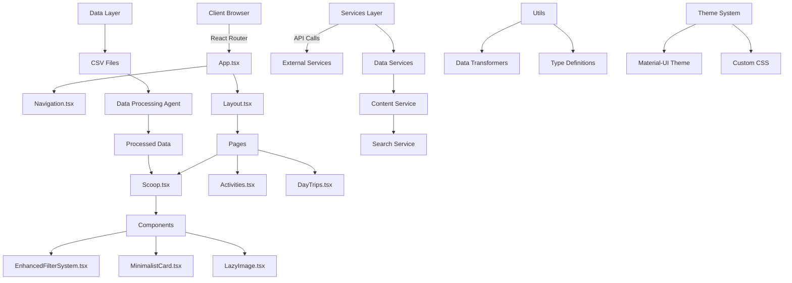
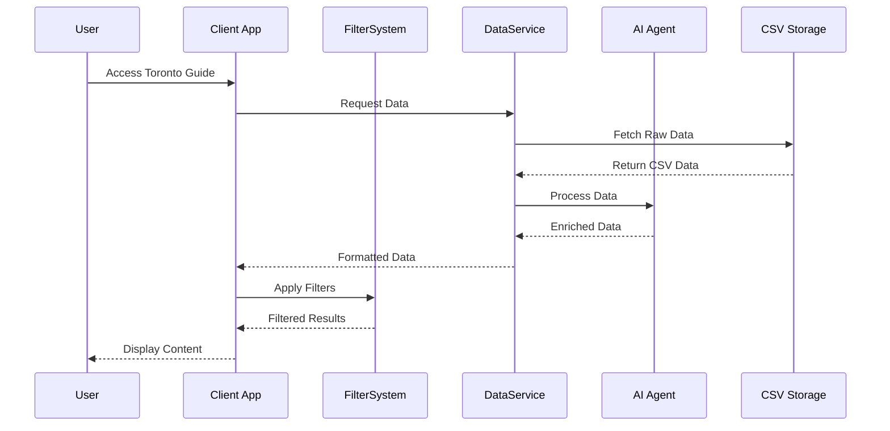
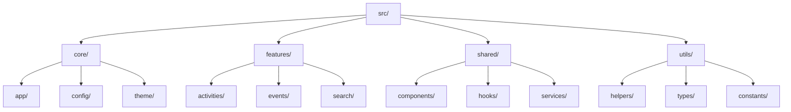

# Toronto Guide Documentation

## Executive Summary

The Toronto Guide is a comprehensive web application designed to be the ultimate digital concierge for Toronto's vibrant lifestyle scene. It provides curated information about attractions, activities, events, and points of interest throughout the city, making it easier for both residents and tourists to discover and engage with Toronto's diverse offerings.

## Value Proposition

- **For Users**: A centralized platform to discover and explore Toronto's attractions, events, and activities with real-time updates and personalized recommendations.
- **For Businesses**: Increased visibility and engagement with target audiences through curated listings and featured content.
- **For Investors**: A scalable platform with multiple revenue streams and growing user engagement in the Toronto lifestyle market.

## Technical Architecture

### Component Architecture


### Data Flow Architecture


### Core Components

1. **Application Entry (src/App.tsx)**
   - Main application container
   - Router configuration
   - Global state management
   - Theme provider setup

2. **Navigation System (src/components/Navigation.tsx)**
   - Responsive navigation menu
   - Dynamic route handling
   - Search integration
   - Mobile-friendly drawer navigation

3. **Filter System (src/components/EnhancedFilterSystem.tsx)**
   - Multi-select filter controls
   - Category-based filtering
   - Tag-based filtering
   - Price range filtering
   - Season filtering
   - Neighborhood filtering

4. **Content Display (src/components/MinimalistCard.tsx)**
   - Responsive card layout
   - Image optimization
   - Content formatting
   - Interactive elements

### Service Layer

1. **Data Services**
   - Location: `src/services/`
   - Handles all data operations
   - CSV processing and transformation
   - Data validation and enrichment
   - Cache management

2. **Theme System**
   - Location: `src/theme.ts`, `src/theme-new.ts`
   - Material-UI theme customization
   - CSS variables management
   - Responsive design utilities
   - Dark mode support

3. **Utility Functions**
   - Location: `src/utils/`
   - Data transformation helpers
   - Type definitions
   - Common utilities
   - Testing helpers

### Performance Optimizations

1. **Image Loading (src/components/LazyImage.tsx)**
   - Lazy loading implementation
   - Progressive image loading
   - Placeholder management
   - Error handling

2. **Route-based Code Splitting**
   ```typescript
   // src/App.tsx
   const Activities = lazy(() => import('./pages/Activities'));
   const DayTrips = lazy(() => import('./pages/DayTrips'));
   ```

3. **Error Boundaries (src/components/ErrorBoundary.tsx)**
   - Graceful error handling
   - Error reporting
   - Fallback UI components

### Data Processing Pipeline

1. **CSV Data Flow**
   - Raw data ingestion
   - Schema validation
   - Data transformation
   - Cache generation

2. **AI Agent Integration**
   - Content enrichment
   - Tag generation
   - Search optimization
   - Quality assurance

### Security Implementation

1. **Protected Routes**
   ```typescript
   // src/components/ProtectedRoute.tsx
   const ProtectedRoute = ({ children }) => {
     const auth = useAuth();
     return auth ? children : <Navigate to="/login" />;
   };
   ```

2. **Admin Authentication**
   - Location: `src/components/AdminLogin.tsx`
   - Secure login system
   - Session management
   - Role-based access control

### Build and Deployment

1. **Build Configuration**
   - Webpack customization
   - Environment management
   - Asset optimization
   - Bundle analysis

2. **Deployment Pipeline**
   - Netlify integration
   - Automated deployments
   - Environment variables
   - SSL configuration

## Data Architecture

### Data Schema
The application uses a standardized data schema for all content:

```typescript
interface ContentItem {
  id: string;
  title: string;
  description: string;
  image: string;
  location: string;
  type: ContentType;
  startDate?: string;
  endDate?: string;
  registrationDeadline?: string;
  duration?: string;
  activityDetails: string;
  cost: string;
  website: string;
  travelTime: string;
  googleMapLink: string;
  lgbtqFriendly: boolean;
  tags: string[];
  lastUpdated: string;
  category: string;
  eventType: string;
  neighborhood: string;
  season: string;
  priceRange: string;
  source: string;
}
```

### Data Flow
1. Content ingestion through CSV files
2. Automated processing and validation
3. Data transformation and normalization
4. Content delivery through React components
5. Regular automated updates

## Development Workflow

### Setup Instructions
1. Clone repository
2. Install dependencies: `npm install`
3. Start development server: `npm start`
4. Access application at `localhost:3008`

### Directory Structure
```
toronto-guide/
├── src/               # Source code
├── public/           # Static assets
├── docs/             # Documentation
├── guides/           # Guide content
├── data/             # Data files
├── scripts/          # Utility scripts
├── design-mockups/   # UI/UX designs
├── data_automation/  # Data processing scripts
└── build/           # Compiled output
```

## AI Integration and Advanced Features

### AI Agent System

The Toronto Guide leverages multiple AI agents that work together to enhance the application's functionality:

1. **Content Curator Agent**
   ```typescript
   // Runs on content updates
   interface CuratorAgent {
     validateContent(content: ContentItem): ValidationResult;
     enrichMetadata(content: ContentItem): EnrichedContent;
     generateTags(content: ContentItem): string[];
     optimizeDescriptions(content: ContentItem): string;
   }
   ```
   - Triggers: Content updates, new submissions, scheduled reviews
   - Functions: Content validation, metadata enrichment, tag generation
   - Location: `src/agents/curator.ts`

2. **Search Optimization Agent**
   ```typescript
   // Runs on search index updates
   interface SearchAgent {
     buildSearchIndex(contents: ContentItem[]): SearchIndex;
     generateSuggestions(query: string): string[];
     optimizeRelevance(results: SearchResult[]): SearchResult[];
   }
   ```
   - Triggers: Data updates, user search patterns
   - Functions: Search index maintenance, suggestion generation
   - Location: `src/agents/search.ts`

3. **Data Processing Agent**
   ```typescript
   // Runs on CSV updates
   interface DataAgent {
     validateSchema(data: unknown): boolean;
     transformData(data: RawData): ProcessedData;
     enrichContent(data: ProcessedData): EnrichedData;
   }
   ```
   - Triggers: CSV uploads, scheduled data updates
   - Functions: Schema validation, data transformation
   - Location: `src/agents/data.ts`

### Route-based Code Splitting

The application implements intelligent code splitting to optimize load times:

```typescript
// src/App.tsx
const Activities = lazy(() => import('./pages/Activities'));
const DayTrips = lazy(() => import('./pages/DayTrips'));
const Events = lazy(() => import('./pages/Events'));

// Implementation
<Suspense fallback={<LoadingSkeleton />}>
  <Routes>
    <Route 
      path="/activities" 
      element={<Activities />} 
      // Preload on hover over navigation
      onMouseEnter={() => import('./pages/Activities')}
    />
    <Route 
      path="/day-trips" 
      element={<DayTrips />}
      onMouseEnter={() => import('./pages/DayTrips')}
    />
  </Routes>
</Suspense>
```

Key features:
- Lazy loading of route components
- Preloading on navigation hover
- Fallback loading states
- Automatic chunk optimization

### Enhanced Filter System

The filter system (`src/components/EnhancedFilterSystem.tsx`) provides a sophisticated filtering experience:

```typescript
interface FilterConfig {
  key: string;
  label: string;
  options: FilterOption[];
  placeholder: string;
}

interface FilterOption {
  value: string;
  label: string;
  disabled?: boolean;
}
```

1. **Performance Optimizations**
   - Memoized filter components
   - Debounced filter updates
   - Hardware-accelerated animations
   - Virtual scrolling for large option lists

2. **Filter Types**
   - Category filters (Activities, Events, etc.)
   - Tag filters (Family-friendly, Outdoor, etc.)
   - Price range filters (Free, $, $$, $$$)
   - Season filters (Summer, Winter, etc.)
   - Neighborhood filters (Downtown, Yorkville, etc.)

3. **State Management**
   ```typescript
   const [selectedFilters, setSelectedFilters] = useState<{
     [key: string]: string[];
   }>({});
   ```
   - Centralized filter state
   - Optimized updates
   - Persistence across sessions

### Content Display System

The MinimalistCard component (`src/components/MinimalistCard.tsx`) implements:

1. **Responsive Layout**
   ```typescript
   interface EnhancedCardData {
     id: string;
     title: string;
     description: string;
     website?: string;
     tags: string[];
     priceRange?: string;
     location?: string;
     coordinates?: {
       lat?: number;
       lng?: number;
     };
   }
   ```
   - Fluid grid system
   - Breakpoint-specific layouts
   - Dynamic content adaptation

2. **Image Optimization**
   - Lazy loading implementation
   - Progressive loading
   - WebP format support
   - Placeholder management

3. **Interactive Features**
   - Hover animations
   - Click actions
   - External links
   - Directions integration

4. **Performance Features**
   - Hardware acceleration
   - CSS-based animations
   - Optimized rerendering
   - Memory management

### Error Handling System

The ErrorBoundary component (`src/components/ErrorBoundary.tsx`) provides:

1. **Error Capture**
   ```typescript
   class ErrorBoundary extends Component<Props, State> {
     public componentDidCatch(error: Error, errorInfo: ErrorInfo) {
       console.error('Uncaught error:', error, errorInfo);
       // Error reporting service integration
     }
   }
   ```
   - Runtime error catching
   - Component tree protection
   - Error isolation

2. **Recovery Mechanisms**
   - Automatic state reset
   - Page reload option
   - Graceful degradation
   - User feedback

3. **Error Reporting**
   - Error logging
   - Stack trace capture
   - User context preservation
   - Analytics integration

### Component Library

The application uses a comprehensive component library:

1. **Base Components**
   ```typescript
   // src/components/base/
   - Button.tsx
   - Input.tsx
   - Card.tsx
   - Typography.tsx
   ```
   - Consistent styling
   - Accessibility support
   - Theme integration
   - Responsive behavior

2. **Composite Components**
   ```typescript
   // src/components/composite/
   - FilterSystem.tsx
   - ContentCard.tsx
   - Navigation.tsx
   - SearchBar.tsx
   ```
   - Business logic encapsulation
   - State management
   - Event handling
   - Data transformation

3. **Layout Components**
   ```typescript
   // src/components/layout/
   - Grid.tsx
   - Container.tsx
   - Section.tsx
   - Sidebar.tsx
   ```
   - Responsive layouts
   - Grid system
   - Spacing utilities
   - Flexbox helpers

4. **Theme Integration**
   ```typescript
   // src/theme/
   export const theme = {
     colors: {
       primary: '#E85A4F',
       secondary: '#A8B5A0',
     },
     spacing: {
       xs: '4px',
       sm: '8px',
       md: '16px',
     },
     breakpoints: {
       mobile: '320px',
       tablet: '768px',
       desktop: '1024px',
     }
   };
   ```
   - Consistent theming
   - Dark mode support
   - Custom properties
   - Design tokens

## Deployment

### Production Build
```bash
npm run build  # Creates optimized build
```

### Hosting Configuration
- Netlify-optimized setup
- Automatic deployments
- CDN distribution
- HTTPS by default

## Monitoring and Analytics

### Performance Metrics
- Page load times
- User engagement
- Search performance
- Error rates

### Usage Analytics
- User behavior tracking
- Popular content analysis
- Search pattern analysis
- Conversion tracking

## Future Roadmap

### Short-term Goals (3-6 months)
- Enhanced search capabilities
- Mobile app development
- Business dashboard
- API development

### Long-term Vision (12+ months)
- Machine learning recommendations
- User personalization
- Business integration platform
- City expansion capability

## Support and Resources

### Documentation
- Technical Specification
- Implementation Guide
- Design System Guide
- Data Update Guide

### Contact Information
- Technical Support: [Contact Information]
- Business Inquiries: [Contact Information]
- Investor Relations: [Contact Information]

## Legal and Compliance

### Data Privacy
- GDPR compliance
- Data retention policies
- User data protection

### Terms of Service
- Usage guidelines
- Content policies
- Service agreements

## Code Organization and Optimization Recommendations

### 1. Directory Structure Optimization



Recommended structure:
```
src/
├── core/                   # Core application setup
│   ├── app/               # App initialization
│   ├── config/            # Configuration
│   └── theme/             # Theme system
├── features/              # Feature modules
│   ├── activities/        # Activities feature
│   ├── events/           # Events feature
│   └── search/           # Search feature
├── shared/               # Shared resources
│   ├── components/       # Shared components
│   ├── hooks/           # Custom hooks
│   └── services/        # Shared services
└── utils/               # Utilities
    ├── helpers/         # Helper functions
    ├── types/           # TypeScript types
    └── constants/       # Constants
```

### 2. Component Organization

1. **Atomic Design Pattern**
   ```typescript
   // src/shared/components/
   ├── atoms/           # Basic building blocks
   │   ├── Button/
   │   ├── Input/
   │   └── Typography/
   ├── molecules/       # Combinations of atoms
   │   ├── SearchBar/
   │   ├── FilterChip/
   │   └── CardHeader/
   ├── organisms/       # Complex components
   │   ├── FilterSystem/
   │   ├── ContentCard/
   │   └── Navigation/
   └── templates/       # Page layouts
       ├── MainLayout/
       └── AdminLayout/
   ```

2. **Component Best Practices**
   ```typescript
   // Example of a well-structured component
   interface Props {
     // Props interface
   }
   
   const Component: React.FC<Props> = memo((props) => {
     // Component logic
   });
   
   Component.displayName = 'Component';
   
   export default Component;
   ```

### 3. State Management Optimization

1. **Context Organization**
   ```typescript
   // src/core/context/
   ├── AppContext.tsx          # Application-wide state
   ├── FilterContext.tsx       # Filter-specific state
   └── ContentContext.tsx      # Content-specific state
   ```

2. **Custom Hooks for Logic**
   ```typescript
   // src/shared/hooks/
   ├── useFilters.ts
   ├── useContent.ts
   ├── useSearch.ts
   └── useAnalytics.ts
   ```

### 4. Performance Optimizations

1. **Code Splitting Strategy**
   ```typescript
   // src/core/app/routes.tsx
   const routes = {
     activities: {
       path: '/activities',
       component: lazy(() => import('features/activities')),
       preload: () => import('features/activities')
     },
     // Other routes
   };
   ```

2. **Memoization Guidelines**
   ```typescript
   // Component optimization example
   const MemoizedComponent = memo(Component, (prev, next) => {
     return prev.id === next.id && prev.version === next.version;
   });
   ```

### 5. AI Agent System Refactoring

1. **Agent Factory Pattern**
   ```typescript
   // src/core/agents/AgentFactory.ts
   class AgentFactory {
     static createAgent(type: AgentType): BaseAgent {
       switch (type) {
         case 'curator':
           return new CuratorAgent();
         case 'search':
           return new SearchAgent();
         // Other agents
       }
     }
   }
   ```

2. **Agent Configuration**
   ```typescript
   // src/core/config/agents.config.ts
   export const agentConfig = {
     curator: {
       updateInterval: 3600000,
       batchSize: 100
     },
     search: {
       indexUpdateInterval: 86400000
     }
   };
   ```

### 6. Data Flow Optimization

1. **Service Layer Pattern**
   ```typescript
   // src/shared/services/BaseService.ts
   abstract class BaseService {
     abstract fetch(): Promise<any>;
     abstract transform(data: any): any;
     abstract validate(data: any): boolean;
   }
   ```

2. **Data Transformation Pipeline**
   ```typescript
   // src/shared/services/DataTransformer.ts
   class DataTransformer {
     static async transform(data: RawData): Promise<ProcessedData> {
       return pipe(
         validate,
         normalize,
         enrich,
         cache
       )(data);
     }
   }
   ```

### 7. Testing Strategy

1. **Test Organization**
   ```
   src/
   └── features/
       └── activities/
           ├── __tests__/
           │   ├── unit/
           │   ├── integration/
           │   └── e2e/
           └── components/
   ```

2. **Test Utilities**
   ```typescript
   // src/utils/test-utils.ts
   export const renderWithProviders = (
     ui: React.ReactElement,
     options = {}
   ) => {
     return render(
       <Providers>{ui}</Providers>,
       options
     );
   };
   ```

### 8. Implementation Recommendations

1. **Immediate Actions**
   - Move components to atomic design structure
   - Implement context-based state management
   - Set up code splitting for all routes
   - Create shared service layer

2. **Gradual Improvements**
   - Refactor AI agents to use factory pattern
   - Implement comprehensive error boundaries
   - Add performance monitoring
   - Enhance test coverage

3. **Long-term Goals**
   - Complete migration to atomic design
   - Implement micro-frontend architecture
   - Add automated performance testing
   - Create component documentation

### 9. Migration Strategy

1. **Phase 1: Structure**
   - Create new directory structure
   - Move files to new locations
   - Update import paths
   - Verify application functionality

2. **Phase 2: Components**
   - Implement atomic design pattern
   - Refactor components
   - Add proper typing
   - Update documentation

3. **Phase 3: State Management**
   - Implement context structure
   - Create custom hooks
   - Migrate existing state
   - Add performance monitoring

4. **Phase 4: Testing**
   - Set up test structure
   - Add unit tests
   - Add integration tests
   - Implement E2E testing

### 10. Monitoring and Maintenance

1. **Performance Metrics**
   ```typescript
   // src/utils/monitoring.ts
   export const monitor = {
     component: (name: string) => {
       performance.mark(`${name}-start`);
       return () => {
         performance.mark(`${name}-end`);
         performance.measure(name, `${name}-start`, `${name}-end`);
       };
     }
   };
   ```

2. **Error Tracking**
   ```typescript
   // src/utils/error-tracking.ts
   export const trackError = (error: Error, context: any) => {
     console.error(error);
     // Send to error tracking service
   };
   ```

---

*Last Updated: June 5, 2025* 